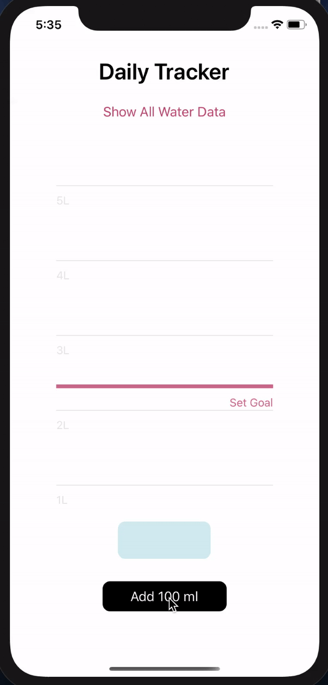
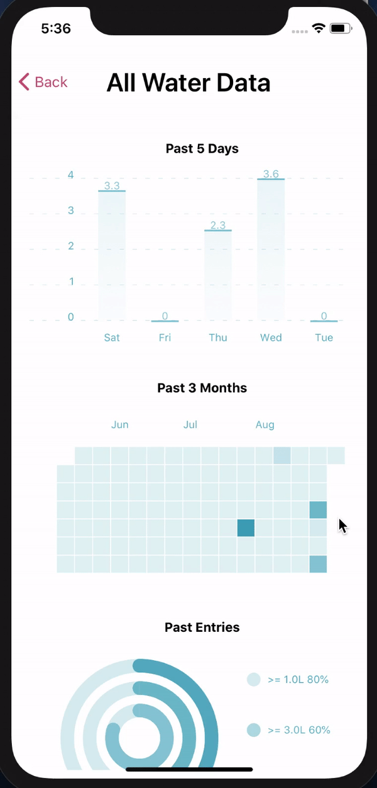

# Water Tracker
This mobile application (react native) will allow you to track how much water you have had throughout the day. You can set a daily goal for yourself, and then manually “add water” to your daily total to reach that goal. You will also be able to see your data from the other times you have used the app (similar to Apple’s health app). The plan is also that this data will be displayed to the user in using a few interactive graphs.

